# 🖥️ 3. Projeto de Interface

<!-- TODO: Reescrever após alinhas as telas de wireframe -->

A criação de interfaces é um processo que combina design visual, experiência do usuário (UX) e desenvolvimento técnico. Primeiro, é realizado um levantamento dos requisitos e objetivos, compreendendo as necessidades dos usuários e as funções do produto. Em seguida, inicia-se o planejamento com wireframes e protótipos que ajudam a estruturar a interface e mapear sua funcionalidade. No momento, as interfaces foram projetada para ser simples, conectando clientes a profissionais qualificados de forma rápida.

## User Flow

O fluxo de usuário (User Flow) é uma técnica que permite ao desenvolvedor mapear todo fluxo de telas do site ou app.

## Wireframes

<!-- INFO: As wireframes foram realizadas por pessoas diferentes, portanto, atualmente apresentam um designs destintos -->
<!-- TODO: Alinhar as wireframes com um mesmo estilo -->

Os Wireframes são protótipos usados em design de interface para sugerir a estrutura de um site web e seu relacionamentos entre suas páginas. Um wireframe web é uma ilustração semelhante do layout de elementos fundamentais na interface.

### T01: Tela Inicial

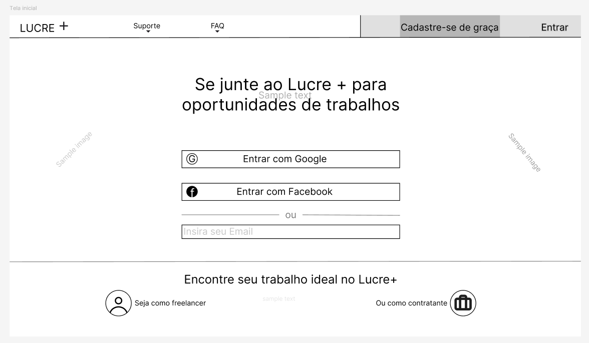

### T02A: Login

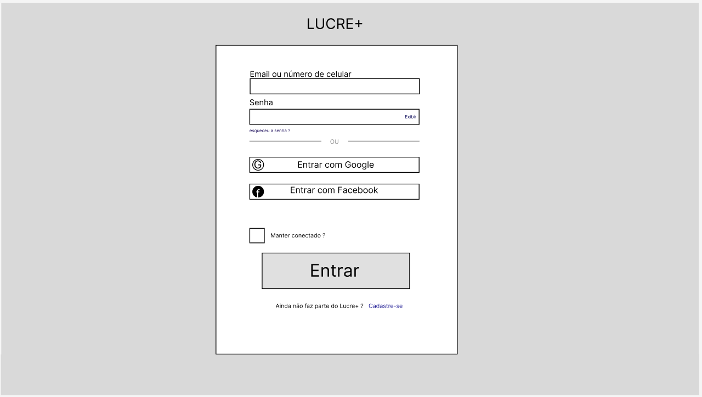

### T02B: Cadastro

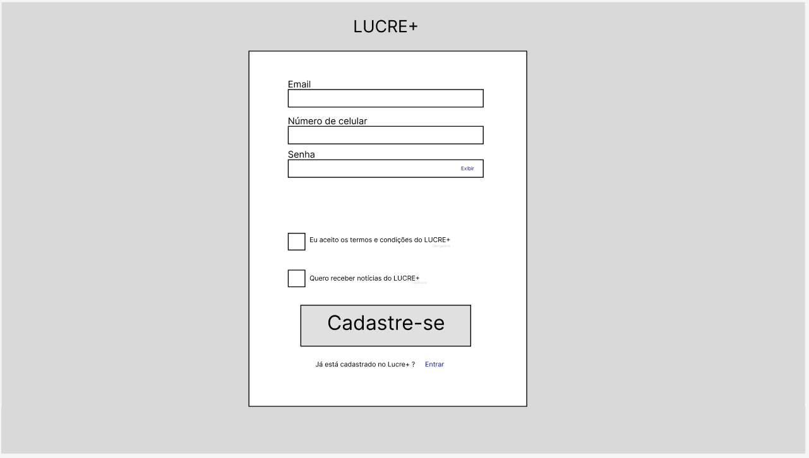

### T03: Criação de Perfil

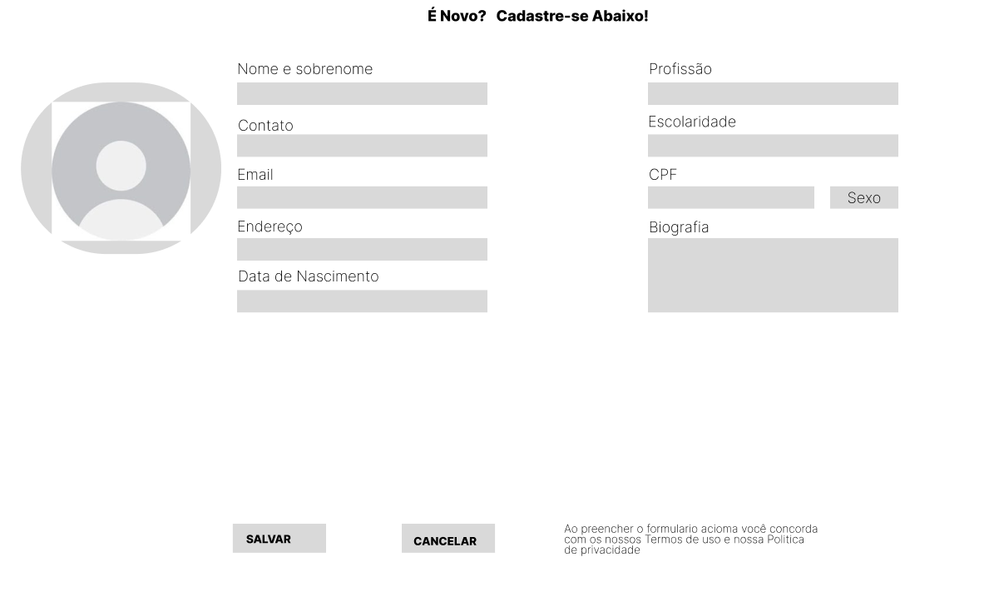

### T04: Home Page

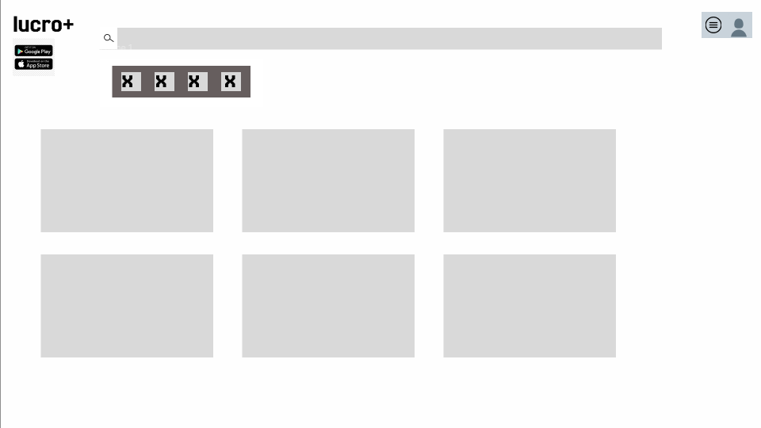

### T05: Cadastro de Serviços/Projetos

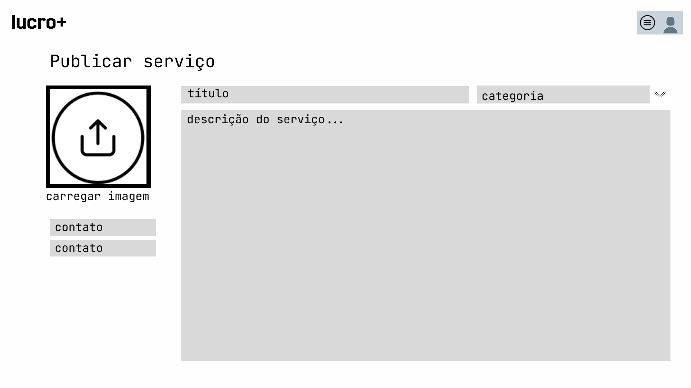

### T06: Resultados da Pesquisa

### T07: Chat

### T08: Andamento do Serviço

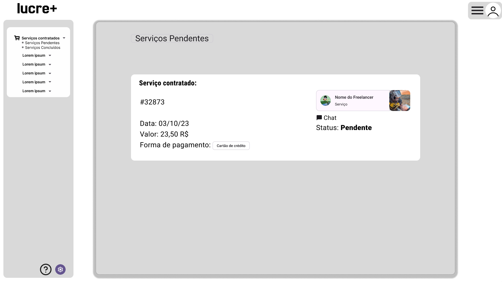

### T09: Perfil

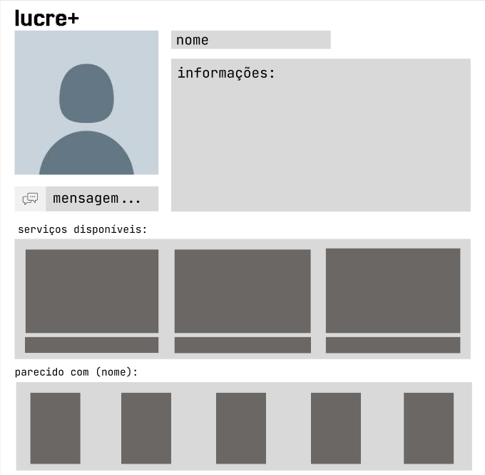

### T10: Pagamento

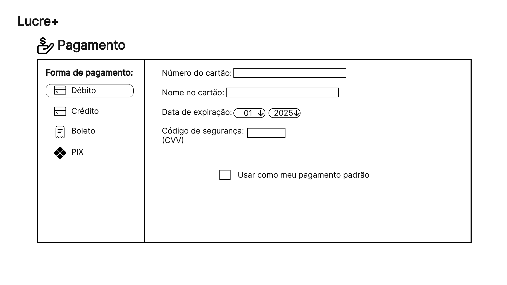

### T11: Portfólio

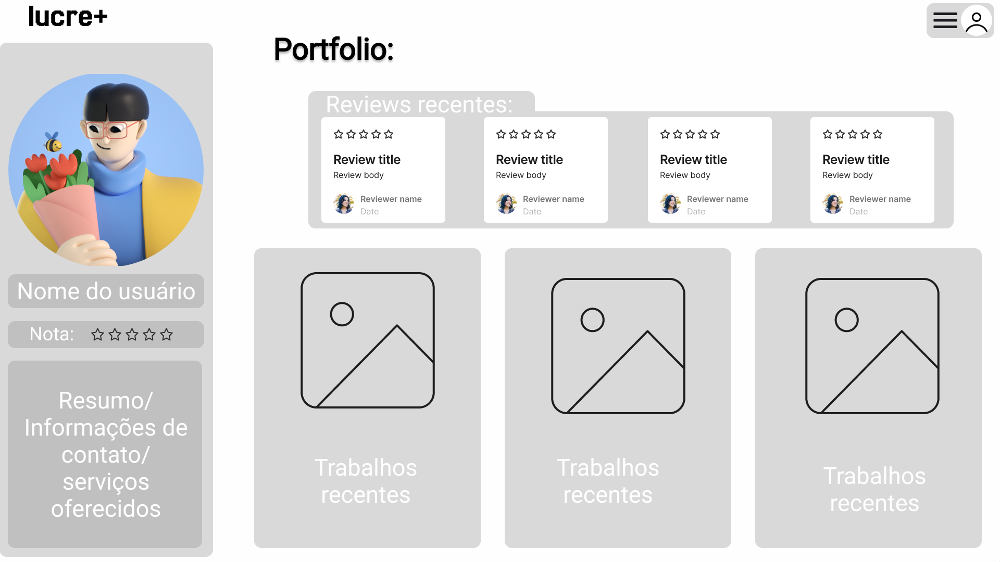

### T12: Avaliação

### T13: Suporte

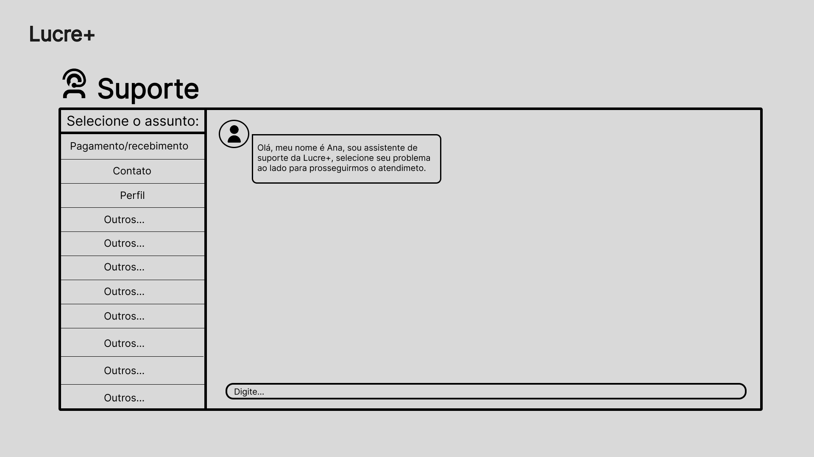
