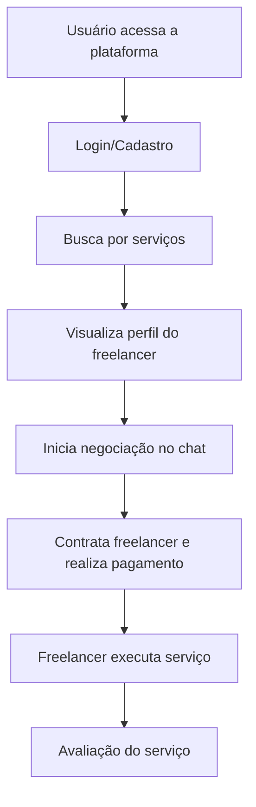

# 🚀 5. Implementação

## 🛠️ Tecnologias Utilizadas

Para o desenvolvimento da solução **Lucre+**, utilizamos as seguintes tecnologias, ferramentas e ambientes de trabalho:

- **Linguagens**: JavaScript, HTML, CSS  
- **Editor de Código**: Visual Studio Code  
- **Controle de Versão**: Git e GitHub  
- **Protótipos**: Figma  
- **Gerenciamento do Projeto**: GitHub Projects (Kanban)

## 🔁 Fluxo de Interação do Usuário

## 💻 Interface do Sistema

### 🏠 Tela Principal

Exibe uma visão geral dos serviços oferecidos com opção de busca por palavras-chave, seleção de categorias e botão de acesso rápido às áreas de login e cadastro.

### Telas de Acesso/Cadastro

Permite a criação de contas com campos como nome, e-mail, senha e tipo de usuário (freelancer ou contratante).

### Perfil do Freelancer

Exibe notas e comentários deixados por clientes anteriores.

### Sistema de Chat

Interface de bate-papo com envio de texto e suporte a notificações.

### Busca de Serviços

Página dedicada para localizar serviços, com opções avançadas de filtragem e classificação por relevância.

- Filtros por categoria
- Filtros por preço
- Filtros por avaliação
- Filtros por localização
